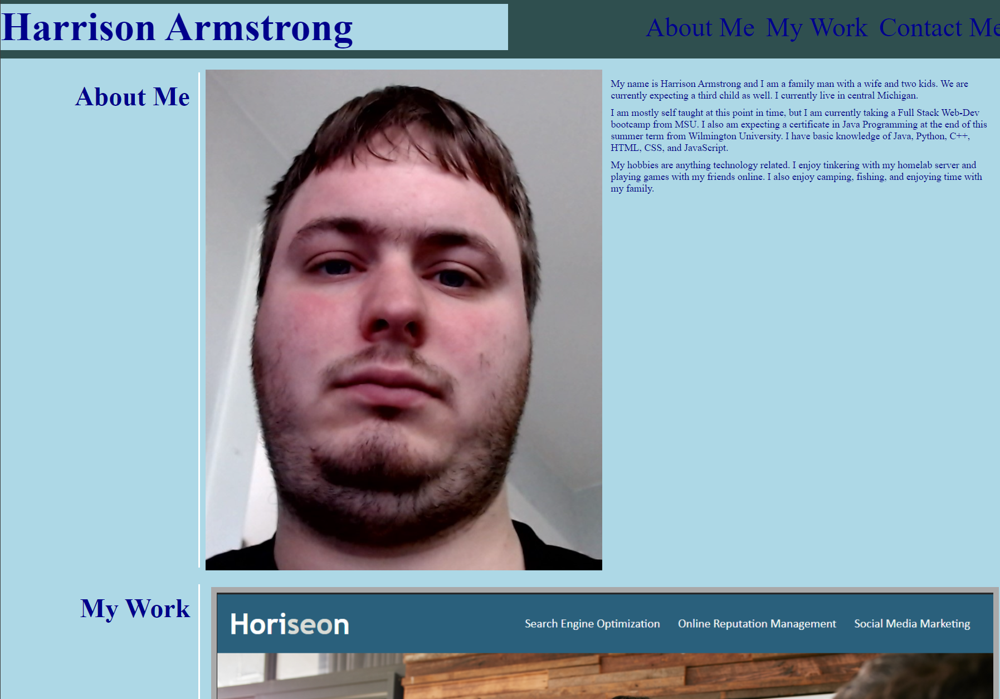

# Personal Portfolio

## Project Details
This project was completed using HTMl and CSS. Using  Semantic HTML and more advanced CSS properties like flex-box and media queries I was assigned to make a webpage that was responsive to different device types and screen.

To achieve the look I wanted for the my work cards I used flex-boxes with flex boxes inside of them which caused me some difficulty, but I was able to figure it out.

I wanted to reproduce the mock-up example's cards that highlight when hovered. I had an issue with the img in the card being displayed on top of the border I was creating so I had to research a solution and found that giving the img a z-index value of -2 caused the box shadow to display how I wanted it to.

## Deployed Webpage

https://nightmarefails.github.io/Personal-Portfolio/

